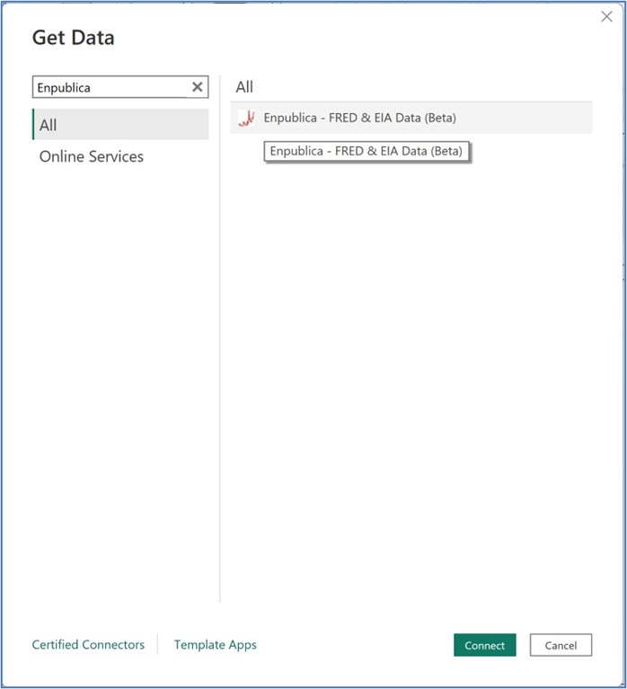
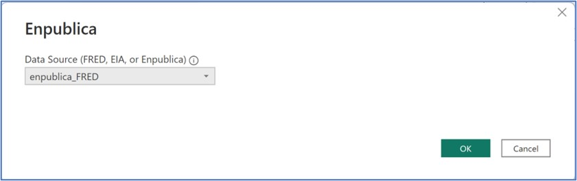
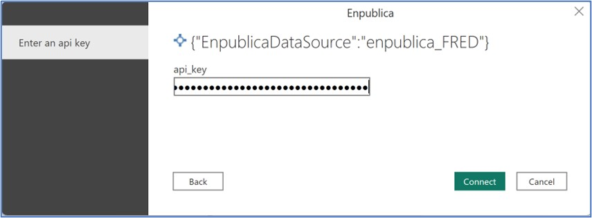
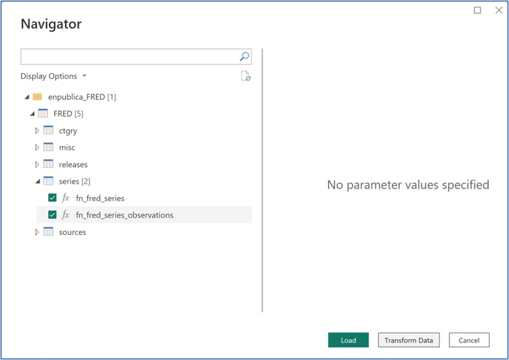
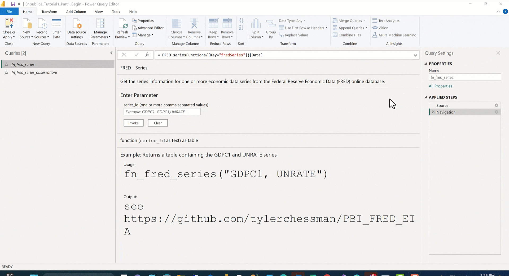
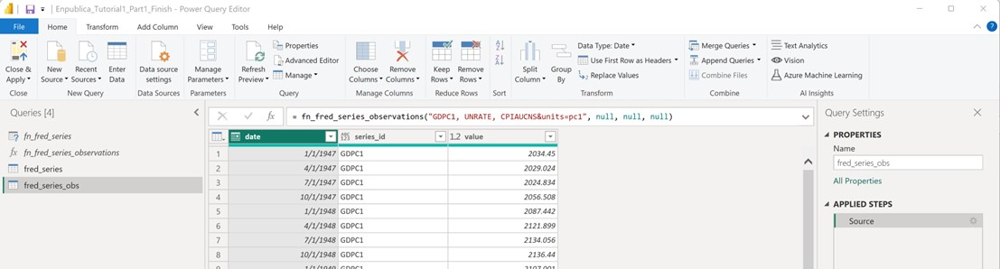

# Enpublica

>[!Note]
>The following connector article is provided by Enpublica, the owner of this connector and a member of the Microsoft Power Query Connector Certification Program. If you have questions regarding the content of this article or have changes you would like to see made to this article, visit the Enpublica website and use the support channels there.

## Summary

| Item | Description |
| ------- | ------------|
|Release state | Preview |
| Products supported | Power BI (Datasets) Power BI (Dataflows) Fabric (Dataflow Gen2) |
| Authentication types supported| Web API |
| Function reference docs | ---- |

## Prerequisites

Each data source exposed by the Enpublica connector requires its own api_key - which needs to be obtained directly from the respective publisher:
* FRED - https://fred.stlouisfed.org/docs/api/api_key.html
* EIA - https://www.eia.gov/opendata/register.php
* Enpublica - submit an <a href="mailto:Support@enpublica.com?subject=New%20API_KEY%20Request&body=Hello%2C%20I%20would%20like%20to%20request%20a%20new%20api_key.%0A%0A%3CNewKeyRequestV1%20DO%20NOT%20MODIFY%20THIS%20LINE%3E">email request</a> for a new api_key.

## Capabilities supported

* Import

## Connect to the St. Louis Federal Reserve Economic Database (FRED)

In the Power BI Desktop, click **Get data**. In the **Get Data** dialog box, type Enpublica in the search box (or look for the connector in the Online Services section), and then click the **Connect** button. **Note** – while the Connector is in Beta, you will see a **Connecting to a third-party service** dialog box; click the **Continue** button.

The Enpublica data connector asks for an initial **Data Source (FRED, EIA, or Enpublica)**; choose **enpublica\_FRED** in the drop-down box and click the **OK** button.

You'll be asked to enter an api key; enter the key value and then click the **Connect** button.

In the Navigator window, expand the FRED table - and then select one or more functions.  For example, click the arrow next to **series**, and then select/check **fn\_fred\_series** and **fn\_fred\_series\_observations**. Next, click the **Transform Data** to open the Power Query Editor.

In the Power Query editor, click **fn\_fred\_series** in the Queries window, and enter the following values into the **series\_id** parameter: **GDPC1, UNRATE, CPIAUCNS**. Next, click the Invoke button; rename the Query to **fred\_series**.

Next click/highlight the **fn\_fred\_series\_observations** function, enter the following values into the series\_id parameter: **GDPC1, UNRATE, CPIAUCNS&units=pc1** , and then click the **Invoke** button. This will return the same three series, but instead of metadata about the series, the actual values (i.e. the observations) are returned. Rename the **Invoked Function** to **fred\_series\_obs**.

In the **Home** ribbon of the Power Query Editor, click the **Close & Apply** button.

## Troubleshooting

**Tip** : in the Power Query Editor, a function definition may sometimes appear to have an error (indicated by a question mark or triangle icon); this can be resolved by simply clicking the function name or (if necessary) selecting **Refresh Preview** from the Home ribbon.

Additional tutorials, tips, and samples (including instructions for connectiong to the EIA and Enpublica data sources) are available at the [Enpublica Data Connector repo](https://github.com/tylerchessman/PBI_FRED_EIA).
